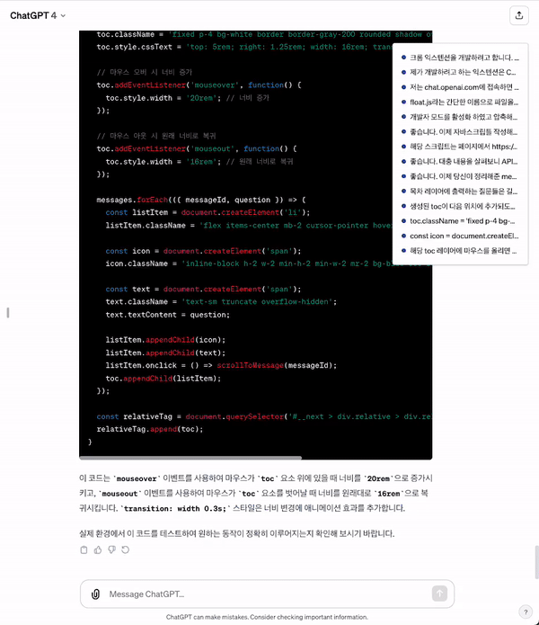

# GPTQuestionFloat

## Introduction

'GPTQuestionFloat' is a Chrome extension designed to enhance your experience with ChatGPT by making it easier to navigate through long conversation threads. This tool quickly identifies questions you've asked in a conversation and allows you to jump directly to that part of the dialogue. It significantly improves your experience with ChatGPT by efficiently managing frequently referred questions.

## How to Use

Once you install the extension and visit chat.openai.com, a floating layer appears on the right side of the screen, displaying a list of questions you've asked during the conversation. Clicking on any question will automatically scroll to that part of the dialogue.

### Instructional Video

For detailed instructions on how to use the extension, please watch the video below:

    

## License

'GPTQuestionFloat' is distributed under the MIT license. For more details, please refer to the [LICENSE](LICENSE.md) file.
